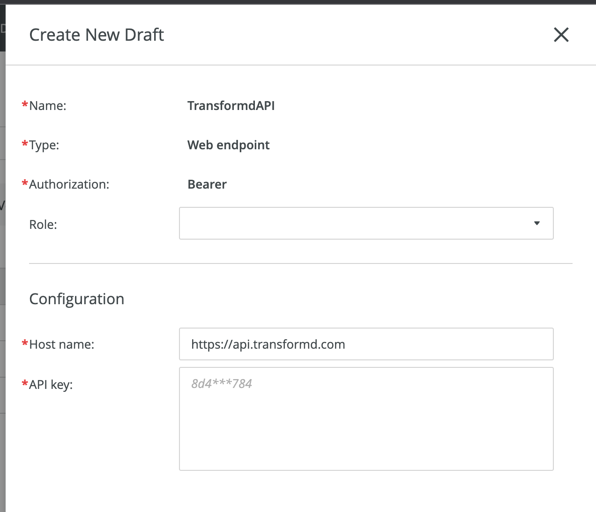

# Transformd Demo Connector


## Overview

A demo pipeline script for use with the
[Quadient Inspire Evolve](https://www.quadient.com/en/customer-communications/inspire-evolve)
and the Generate service. This component is part of a larger demonstration
showing the integration of Quadient's Software-as-a-Service (SaaS)-based
customer communication solution (Evolve) and the [Transformd](https://transformd.com/)
platform for creating personalized customer experiences through forms and
workflow automation.

## Getting Started

### Prerequisites

In order to build and use the connector, the following software must be
installed:

- [NodeJS](https://nodejs.org)
- [npm](https://npmjs.com)
- [Bobril build](https://www.npmjs.com/package/bobril-build)
- [Swarm](https://www.npmjs.com/package/@quadient/swarm) (optional)

### Build and Use

To build the script component, clone this repository:

```bash
git clone https://github.com/robertwtucker/transformd-demo-connector.git
```

Run `Bobril build` to generate the `dist/a.js` file:

```bash
cd transformd-demo-connector
npm run build
```

Open the **Generate** service UI and select the _Scripting_ section under the
_Content Manager_ tab. Click the _Upload New_ button to open the Upload New
Script dialog. Fill out the _Name_ and _Category_ fields. For the _Script_
field, browse to the `dist/a.js` file in the project directory. Click the
_Upload_ button to upload the script to the server.


As an alternative, if the [`swarm`](<(https://www.npmjs.com/package/@quadient/swarm)>)
package is installed and configured (beyond the scope of this document), you
can automate the process in the terminal:

```bash
npm run script-upload
```

Regardless of the upload method used, you must click the _Publish Draft_ button
while highlighting the script you created. Otherwise, the script will not be
available for use in pipelines.

Still in the _Content Manager_ tab, select the _Connectors_ section and click
the `+`&nbsp;_New_ button. A completed connector definition can be found below. Be
sure to publish the new connector before creating a pipeline that will use it.



To create a pipeline, select the _Processing Pipelines_ section under th
_Design_ tab. Click the `+`&nbsp;_New_ button to create a pipeline. Click the `{js}`
(_Custom Modules_) button on the left panel and drag the _Transformd Connector_
script over to the pipeline. Complete the properties section as required. An
example is pictured below.


## Roadmap

See the [open issues](https://github.com/robertwtucker/transformd-demo-connector/issues) for a list of proposed features (and known issues).

## Contributing

Contributions are what make the open source community such an amazing place to learn, inspire, and create. Any contributions you make are sincerely appreciated.

1. Fork the Project
2. Create your Feature Branch (`git checkout -b feature/AmazingFeature`)
3. Commit your Changes (`git commit -m 'Add some AmazingFeature'`)
4. Push to the Branch (`git push origin feature/AmazingFeature`)
5. Open a Pull Request

## License

Copyright (c) 2023 Quadient Group AG and distributed under the MIT License. See `LICENSE` for more information.

## Contact

Robert Tucker - [@robertwtucker](https://twitter.com/robertwtucker)

Project Link: [https://github.com/robertwtucker/transformd-demo-connector](https://github.com/robertwtucker/transformd-demo-connector)
